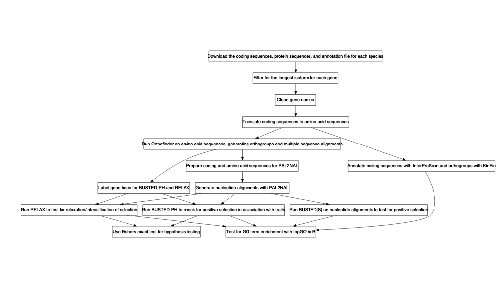
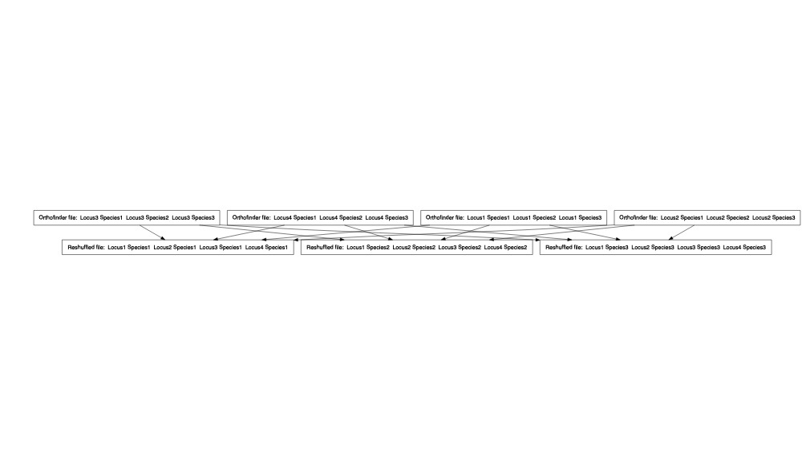

Comparative Genomic Analysis Workflow
================
Megan Barkdull

## Introduction

This repository hosts the workflow for a comparative genomics analysis.
The general overview
is:

### Using this workflow:

To use this workflow, simply clone this repository onto your own
machine. You will run all Bash scripts in the main directory associated
with this repository (i.e., in `/FormicidaeMolecularEvolution/`)

## 1\. Downloading data:

For a project of this kind, you will need transcript data from your
species of interest. The Bash script `DataDownload` can download these
data for you. This script requires an input file, which should be a
tab-delimited text file with:

  - Download URLs in the first column
  - The file names that you want your data downloaded to in the second
    column, formatted like:
    `FOURLETTERTAXONABBREVIATION_transcripts.fasta`.

See `./scripts/inputurls.txt` for an example.

Once you have an input URLs file, simply run the script by executing the
following command in a Bash shell:

`./scripts/DataDownload ./scripts/inputurls.txt`

This will create a new directory, `./RawData`, containing the downloaded
transcript files.

## 2\. Cleaning the raw data:

The raw data is likely to have several features that will make future
steps difficult or annoying. To solve this problem, you’ll want to run
the script `DataCleaning`. This will remove any special characters from
gene names (for example, \_ or (), which Orthofinder will change,
causing errors) and add your four-letter taxon abbreviation to the
beginning of each gene name. To run this script, simply use the command:

`./scripts/DataCleaning ./scripts/inputurls.txt`

This will create a new directory, `./CleanedData`, that contains the
cleaned transcript files.

## 3\. Translating nucleotide sequences to amino acid sequences:

For many steps of this workflow, you’ll actually need amino acid
sequences rather than protein sequences. Therefore, we’ll need to
translate the data we downloaded. This will be done in one of two ways:

  - If the data you downloaded are raw transcript data, meaning for
    example that they don’t start with a start codon, then we’ll use
    Transdecoder to process and translate them into meaningful amino
    acid sequences.
  - If they have already been processed and begin with start codons, we
    can take a simpler route and just translate them with the use of a
    codon table.

The script `./scripts/DataTranslating` takes care of this process for
us. It will attempt to run
[Transdecoder](https://github.com/TransDecoder/TransDecoder/wiki) on
each cleaned transcripts file; if the data is unprocessed, this will
give us a translated output file. If the data is already processed,
Transdecoder will fail to run and the script will instead translate the
file with my Python script,
`./scripts/TranscriptFilesTranslateScript.py`.

***This step uses the path to Transdecoder on Cornell’s BioHPC. I plan
to update the script in future so that it is more portabe. In the
meantime, you’d need to edit lines 26 and 27 of
`./scripts/DataTranslating` so that they point to Transdecoder on your
machine.***

To run this step, simply use the command:

`./scripts/DataTranslating ./scripts/inputurls.txt`

This will create a new directory, `./TranslatedData/OutputFiles/`, that
contains the translated transcript files.

If you use Transdecoder, please cite it as: Haas, B., and A.
Papanicolaou. “TransDecoder.” (2017).

## 4\. Running Orthofinder:

Next, we will use [Orthofinder](https://davidemms.github.io) to identify
groups of orthologous genes in our amino acid sequences, and to produce
multiple sequence alignments with MAFFT. To run Orthofinder
automatically, you can use the Bash script `DataOrthofinder`. ***This
script takes a version number as a command line option to run either the
most recent version (“current”) or version 2.3.8. The script is
currently written to work on Cornell’s BioHPC, and so may require some
changes to run on other machines (editing at least lines 14-16 and
42-46).***

To run this step, use the command: " `./scripts/DataOrthofinder [version
number, either "current" or 2.3.8]`

This will infer orthogroups and multiple-sequence alignment-based gene
trees; MAFFT is used to generate the multiple sequence alignments and
FastTree to generate the gene trees. Outputs will be found in a new
subdirectory of `/FormicidaeMolecularEvolution/`,
`./OrthoFinder/fasta/OrthoFinder`.

If you use Orthofinder, please cite it:

  - OrthoFinder’s orthogroup and ortholog inference are described here:
      - Emms, D.M., Kelly, S. OrthoFinder: solving fundamental biases in
        whole genome comparisons dramatically improves orthogroup
        inference accuracy. Genome Biol 16, 157 (2015)
      - Emms, D.M., Kelly, S. OrthoFinder: phylogenetic orthology
        inference for comparative genomics. Genome Biol 20, 238 (2019)
  - If you use the OrthoFinder species tree then also cite:
      - Emms D.M. & Kelly S. STRIDE: Species Tree Root Inference from
        Gene Duplication Events (2017), Mol Biol Evol 34(12): 3267-3278
      - Emms D.M. & Kelly S. STAG: Species Tree Inference from All Genes
        (2018), bioRxiv <https://doi.org/10.1101/267914>

Please also cite MAFFT:

  - K. Katoh, K. Misawa, K. Kuma, and T. Miyata. 2002. MAFFT: a novel
    method for rapid multiple sequence alignment based on fast Fourier
    transform. Nucleic Acids Res. 30(14): 3059-3066.

## 5\. Preparing files for PAL2NAL:

### 5.1 Reordering multiple sequence alignment files for PAL2NAL

Orthofinder produces a single file for every individual orthogroup,
containing the alignments for the sequences in that orthogroup. However,
in order to create codon-aware alignments with PAL2NAL, we need files
that contain all of the alignments for each individual
species.

The R script `DataMSA.R` will recombine the Orthofinder outputs so that
they can be input to PAL2NAL. To run the script, you’ll need to get the
full path to the MSA files created by Orthofinder in the previous step
(it will be something like
`/workdir/mb2337/FormicidaeMolecularEvolution/OrthoFinder/fasta/OrthoFinder/Results_Oct26/MultipleSequenceAlignments`).
Then use the command:

`./scripts/DataMSA.R ./scripts/inputurls /FullPathToMSAFiles`

### 5.2 Filtering coding sequences for PAL2NAL:

The nucleotide sequence file that is run through PAL2NAL can have only
the genes that are also present in the protein alignment file. Since our
protein alignment files contain only a subset of genes, we need to
filter through the nucleotide sequence files so that they too contain
only this subset. To do this, use the R script `FilteringCDSbyMSA.R`.
This script checks whether genes in the coding sequence file are present
in the multiple sequence alignment file, then pulls the corresponding
nucleotide sequences from the coding sequence file into a new, filtered
output.

To run this step, just use the command: `/scripts/FilteringCDSbyMSA.R
./scripts/inputurls`

This script will output filtered coding sequence files to the
subdirectory `./FilteredCDS`.

## 6\. Generating codon-aware nucleotide alignments with PAL2NAL:

PAL2NAL will generate codon-aware nucleotide alignments, based on an
input of an amino acid multiple sequence alignment and a nucleotide
sequence. These inputs have been generated by the previous step.

Now, to run PAL2NAL, use the Bash script `./scripts/DataRunPAL2NAL` by
executing the command:

`./scripts/DataRunPAL2NAL ./inputurls.txt`

This will produce a new directory, `./PAL2NALOutput`, containing an
aligned nucleotide sequence file for each species.

## Testing for positive selection with BUSTED\[S\]

For the step where you must convert the outputs of OrthoFinder to be
inputs for RERConverge, please see the [Comparative Genomics
repository](https://github.com/mbarkdull/ComparativeGenomics)
